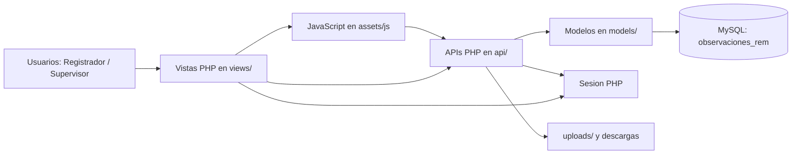
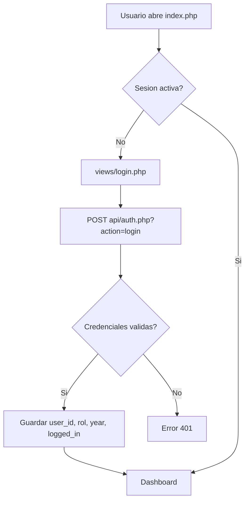
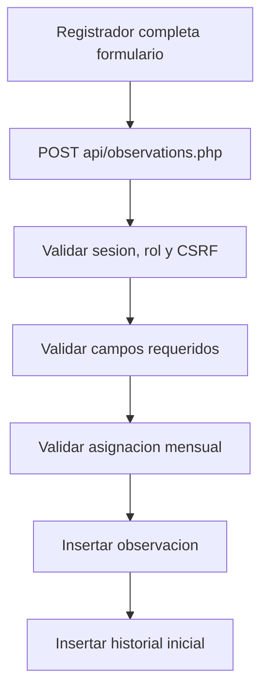
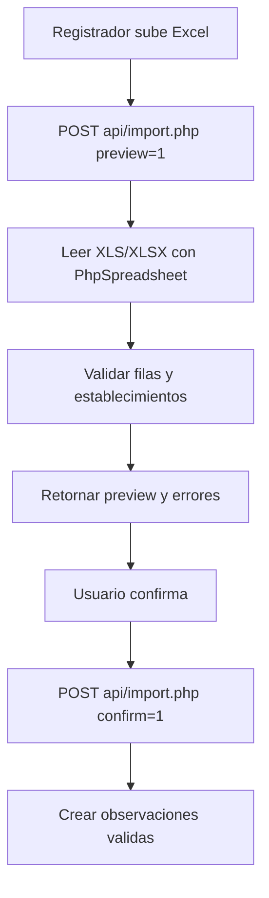
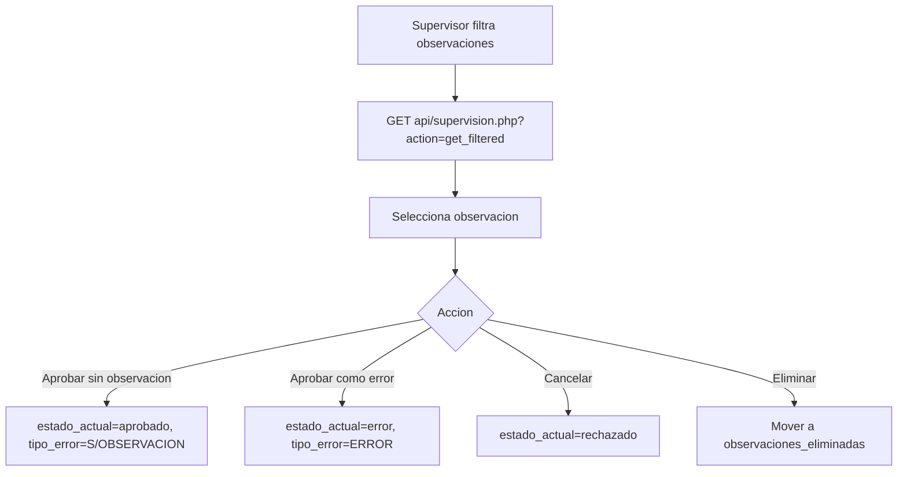
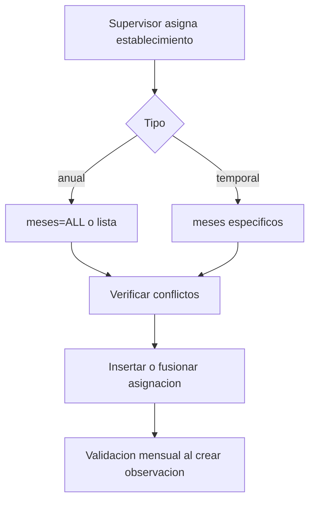
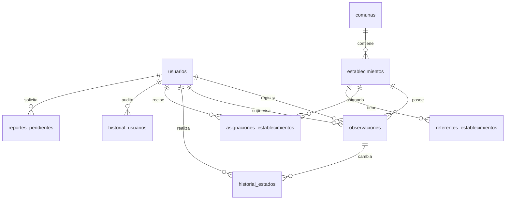

# Sistema de Observaciones REM

Sistema de gestion y registro de observaciones del Resumen Estadistico Mensual (REM) para el Servicio de Salud Osorno.

## 📋 Descripcion General

El Sistema de Observaciones REM centraliza el registro, revision, supervision, importacion y reporte de observaciones asociadas a los reportes REM de establecimientos de salud. Su operacion se organiza alrededor de dos perfiles principales: registradores, responsables de ingresar observaciones de establecimientos asignados, y supervisores, responsables de revisar, aprobar, cancelar, gestionar usuarios, administrar asignaciones y generar reportes consolidados.

El sistema opera por año de trabajo, guardado en sesion, y permite gestionar informacion historica por periodo. La aplicacion esta orientada al control operativo de observaciones REM, seguimiento de errores, cumplimiento de plazos, uso de validador y generacion de informes para gestion sanitaria.

## 🧭 Estado Del Descubrimiento Spec Kit

Este documento corresponde al Paso 0 del flujo Spec Kit (`/speckit.discover`) y debe tratarse como la fuente base para comandos posteriores como `/speckit.constitution`, `/speckit.specify`, `/speckit.plan` y `/speckit.tasks`. La constitucion vigente del proyecto esta en `.specify/memory/constitution.md` y gobierna seguridad, trazabilidad, integridad de datos, verificaciones y flujo de desarrollo.

Fuentes revisadas durante la ingenieria inversa:

| Fuente | Evidencia obtenida |
|---|---|
| `index.php` | Punto de entrada, router por pagina y permisos basicos por rol. |
| `config/` | Conexion MySQL, constantes de negocio, migraciones SQL y configuracion de sesion. |
| `models/` | Reglas de negocio, consultas SQL, reportes, asignaciones, papelera, usuarios y versionado. |
| `api/` | Contratos HTTP reales, acciones por endpoint, validaciones y permisos. |
| `views/` | Flujos de usuario, formularios, consumo de APIs y experiencia frontend. |
| `assets/` | JS compartido, notificaciones, graficos y estilos. |
| `specs/` | Especificaciones previas por modulo y migraciones por sprint. |
| `A.md` | Documentacion historica del sistema, funcionalidades declaradas y despliegue. |
| Scripts raiz | Pruebas manuales, seed demo, worker de reportes y verificacion de modelo. |

Validaciones ejecutadas:

| Verificacion | Resultado |
|---|---|
| `php -v` | PHP 8.2.12 disponible en CLI. |
| `php -l` sobre todos los `.php` | Sin errores de sintaxis. |
| `composer validate --no-check-publish` | No concluyente por error del wrapper de Windows: `No se esperaba & en este momento.` |

## 🏗️ Arquitectura

La aplicacion es un monolito PHP tradicional desplegable en Apache/XAMPP. Usa vistas PHP renderizadas en servidor, APIs PHP por archivo para operaciones asincronas desde JavaScript, modelos PHP con SQL embebido via PDO y una base de datos MySQL/MariaDB.



Capas tecnicas principales:

| Capa | Implementacion | Responsabilidad |
|---|---|---|
| Entrada | `index.php` | Verifica sesion, pagina solicitada y permisos basicos por rol. |
| Presentacion | `views/*.php`, `includes/*.php` | Renderiza pantallas, formularios, layout, sidebar, header y footer. |
| Interaccion cliente | `assets/js/*.js` | `fetch`, notificaciones, graficos y manejo de UI. |
| API | `api/*.php` | Endpoints por archivo, acciones por query/body y respuestas JSON o descarga. |
| Dominio/Datos | `models/*.php` | Consultas SQL, reglas de negocio, reportes y persistencia. |
| Configuracion | `config/*.php`, `config/*.sql` | Credenciales, constantes, migraciones y catalogos base. |
| Base de datos | MySQL/MariaDB | Persistencia relacional del sistema. |

Patrones observados:

| Patron | Uso actual |
|---|---|
| Singleton | `Database::getInstance()` mantiene una conexion PDO compartida. |
| Active Record parcial / Table Gateway informal | Cada modelo encapsula consultas de una o varias tablas. |
| API por archivo/action | Endpoints como `api/auth.php?action=login` o `api/reports.php?report=all`. |
| Sesion servidor | `$_SESSION` guarda usuario, rol, año y estado de autenticacion. |
| Control de acceso por rol | Validaciones distribuidas en `index.php` y endpoints. |
| CSRF manual | `includes/csrf.php` valida header `X-CSRF-Token` o campo POST. |

## 🧰 Stack Tecnologico y Dependencias

| Categoria | Tecnologia / Dependencia | Uso |
|---|---|---|
| Backend | PHP 7.4+ declarado; PHP 8.2.12 observado | Logica de aplicacion, APIs, vistas y modelos. |
| Base de datos | MySQL 5.7+ / MariaDB compatible | Persistencia relacional. |
| Acceso a datos | PDO MySQL | Consultas preparadas y transacciones. |
| Servidor web | Apache / XAMPP | Ejecucion local y despliegue tradicional. |
| Frontend | HTML5, CSS3, JavaScript ES6+ | Interfaz de usuario y consumo de APIs. |
| UI | Tabler 1.4 (`@tabler/core` + `@tabler/icons-webfont`) / CSS propio | Layout, componentes visuales y estilos. |
| Design tokens | `assets/css/tokens.css` (CSS custom properties) | Identidad visual, status, radius, dark mode. |
| Graficos | Chart.js | Dashboard y reportes visuales. |
| Excel | `phpoffice/phpspreadsheet:^5.4` | Importacion y exportacion Excel. |
| PDF | `tecnickcom/tcpdf:^6.10` | Exportacion PDF e informes. |
| Gestion dependencias | Composer | Instalacion de librerias PHP. |
| Especificacion | Spec Kit / OpenSpec | Documentacion y flujo SDD. |

Dependencias Composer actuales:

```json
{
  "phpoffice/phpspreadsheet": "^5.4",
  "tecnickcom/tcpdf": "^6.10"
}
```

## 📁 Estructura Del Proyecto

```text
Sistema_ObservacionesV3/
├── api/                         # Endpoints HTTP/JSON y descargas
│   ├── auth.php                 # Login, logout, check y cambio de año
│   ├── observations.php         # CRUD de observaciones e historial
│   ├── supervision.php          # Aprobacion, cancelacion, detalle y papelera
│   ├── reports.php              # Datos agregados para graficos/reportes
│   ├── export.php               # Exportacion Excel/PDF sincronica
│   ├── import.php               # Importacion Excel preview/confirm
│   ├── import_template.php      # Plantilla Excel
│   ├── locations.php            # Comunas y establecimientos
│   ├── assignments.php          # Asignaciones anuales/temporales
│   ├── users.php                # Gestion de usuarios
│   ├── deleted.php              # Papelera de observaciones eliminadas
│   ├── informe_errores.php      # Informe REM de errores trimestral/anual
│   └── versioning.php           # Snapshots y rollback del sistema
├── assets/
│   ├── css/                     # Estilos globales, tokens y overrides Tabler
│   │   ├── styles.css           # Legacy (en deprecacion, no extender)
│   │   ├── tokens.css           # Design tokens (CSS custom properties)
│   │   └── tabler-override.css  # Overrides Tabler (sidebar, header, cards, a11y)
│   ├── js/                      # JS comun, theme, charts y shell
│   │   ├── app.js               # fetchAPI, toasts, countup
│   │   ├── theme.js             # theme toggle, sidebar, search, FAB
│   │   └── charts.js            # Chart.js helpers con tokens
│   └── images/                  # Logos e imagenes institucionales
├── config/
│   ├── config.php               # BD, rutas, sesion y entorno
│   ├── constants.php            # Estados, roles, meses, series y hojas REM
│   ├── init_db.sql              # Esquema inicial y datos base
│   ├── migration_*.sql          # Migraciones posteriores
│   └── migrations/              # Migraciones adicionales
├── includes/
│   ├── header.php               # Shell topbar (busqueda, notificaciones, year, theme)
│   ├── sidebar.php              # Sidebar vertical con mini-variant y status dot
│   ├── footer.php               # Footer, toast container, FAB y carga de assets
│   ├── breadcrumbs.php          # Helper de migas de pan
│   ├── icons.php                # Iconos SVG legacy (deprecados a favor de tabler-icons-webfont)
│   └── csrf.php                 # Generacion/validacion de token CSRF
├── models/
│   ├── Database.php             # PDO Singleton
│   ├── User.php                 # Usuarios y autenticacion
│   ├── UserAudit.php            # Auditoria de usuarios
│   ├── Observation.php          # Observaciones, estados, reportes e informes
│   ├── Location.php             # Comunas y establecimientos
│   ├── EstablecimientoAsignacion.php # Asignaciones anuales/temporales
│   ├── DeletedObservation.php   # Papelera y restauracion
│   ├── Exporter.php             # Excel/PDF
│   ├── ReportQueue.php          # Cola de reportes asincronos
│   └── Version.php              # Versionado interno
├── views/
│   ├── login.php                # Inicio de sesion
│   ├── dashboard.php            # Panel principal
│   ├── observaciones.php        # Gestion de observaciones
│   ├── supervision.php          # Revision de supervisor
│   ├── reportes.php             # Reportes y graficos
│   ├── usuarios.php             # Administracion de usuarios
│   ├── perfil.php               # Perfil y cambio de contraseña
│   ├── asignaciones.php         # Asignacion de establecimientos
│   ├── eliminadas.php           # Papelera
│   └── establecimientos.php     # Gestion de establecimientos
├── specs/                       # Especificaciones por modulo y migraciones por sprint
├── openspec/                    # Cambios OpenSpec activos/archivados
├── .specify/                    # Configuracion Spec Kit
├── uploads/                     # Archivos importados/reportes generados, ignorado por Git
├── index.php                    # Router principal
├── worker_reportes.php          # Worker de reportes pendientes
├── seed_demo.php                # Seed de usuarios demo en desarrollo
├── test_*.php                   # Pruebas manuales con efectos en BD
├── verify_model.php             # Verificacion puntual de modelo
├── composer.json                # Dependencias PHP
├── A.md                         # Documentacion historica previa
└── README.md                    # Fuente de verdad generada por /speckit.discover
```

## 🎨 Mejora Visual (Tabler)

La capa visual se compone de:

- `assets/css/tokens.css` con variables CSS para colores, status, radius, sombras, gradientes y dark mode.
- `assets/css/tabler-override.css` con overrides semanticos (sidebar, header, cards, badges, modals, alerts, focus ring, animaciones y FAB).
- `@tabler/icons-webfont` cargado por CDN para reemplazar los SVG inline.
- `assets/js/theme.js` con theme toggle, mini-variant, busqueda global y FAB de tema al hacer scroll.
- `assets/js/app.js` con `initCountUp` para animar los KPIs del dashboard.
- `assets/js/charts.js` con `chartTokenColor` y `chartBaseFont` para que las charts hereden la paleta.

El shell autenticado incluye skip link, breadcrumb, dropdown de notificaciones, selector de año, theme switcher y user menu con avatar. El login usa split layout con hero salud, form-floating y accordion de credenciales demo.

### Theming Light/Dark

La constitucion del proyecto define un contrato visual explicito para temas `light` y `dark`. El tema por defecto es `light`; si el usuario cambia a `dark`, `assets/js/theme.js` persiste la decision en cookie `rem.theme` con `path=/` y un año de duracion, y mantiene `localStorage` como fallback cliente. `includes/header.php` y `views/login.php` leen esa cookie para renderizar `data-bs-theme` en el HTML inicial y evitar cambios de tema o flashes al navegar.

Los colores nuevos deben vivir en `assets/css/tokens.css` y consumirse desde `assets/css/tabler-override.css` o desde helpers JS. Los graficos usan tokens `--chart-*`, registran sus instancias en `window.REMCharts` y se actualizan cuando `theme.js` emite `rem:theme-changed`.

### Contrato UI v2 Para Reestructuracion

- Ecosistema UI: usar estrictamente Tabler 1.4 mediante `@tabler/core` y `@tabler/icons-webfont`; no introducir Tailwind, Bootstrap standalone u otros frameworks CSS.
- Estilos: definir colores, sombras y variables visuales en `assets/css/tokens.css`; personalizaciones semanticas en `assets/css/tabler-override.css`; `assets/css/styles.css` esta deprecado y no debe extenderse.
- Temas: mantener `data-bs-theme`, cookie `rem.theme`, fallback `localStorage` y evento `rem:theme-changed` para refrescar Chart.js.
- APIs: consumir `api/*.php` con `fetch`; toda peticion mutable debe incluir CSRF mediante `X-CSRF-Token` o campo POST gestionado por `includes/csrf.php`.
- Modulos: cada `views/*.php` debe ser independiente y reutilizar `includes/header.php`, `includes/sidebar.php`, `includes/footer.php` y `includes/breadcrumbs.php`.
- Accesibilidad: preservar skip links, ARIA nativo de Tabler y contraste WCAG 2.1 AA en light/dark.
- HTML: no agregar nuevos `style="..."`; migrar estilos inline existentes durante la reestructuracion del modulo afectado.
- Dominio: la UI debe reflejar `config/constants.php` y no inventar estados, roles, tipos o etiquetas REM en frontend.

## 👥 Roles y Permisos

### Registrador

El registrador es el usuario operativo que registra observaciones REM para los establecimientos que tiene asignados en el año y mes correspondiente. Puede crear observaciones, editar sus propias observaciones mientras permanezcan pendientes, importar observaciones desde Excel, consultar sus registros y acceder a reportes filtrados por sus propios datos.

Restricciones principales:

- Solo puede crear observaciones si el establecimiento esta asignado para el mes seleccionado.
- Solo ve sus propias observaciones en listados generales y reportes.
- No puede acceder a supervision, usuarios, asignaciones, papelera ni gestion de establecimientos.
- No puede editar observaciones que ya no esten en estado `pendiente`.

### Supervisor

El supervisor administra y controla el sistema. Puede revisar observaciones, aprobarlas como `S/OBSERVACION` o marcarlas como `ERROR`, cancelar registros, mover observaciones a papelera, restaurarlas o eliminarlas permanentemente, gestionar usuarios, administrar asignaciones, mantener establecimientos y generar informes consolidados.

Restricciones principales:

- No crea observaciones desde `api/observations.php`; esa accion esta limitada a registradores.
- Puede ver informacion global de todos los registradores y establecimientos.
- Tiene acceso a vistas administrativas protegidas por `index.php` y por validaciones en APIs.

## 🔄 Flujos Principales

### Login y Seleccion de Año



Pasos:

1. El usuario ingresa credenciales y año de trabajo.
2. `api/auth.php?action=login` valida contra `usuarios.password_hash`.
3. La sesion guarda `user_id`, `username`, `nombre_completo`, `rol`, `year` y `logged_in`.
4. El sistema redirige al dashboard.
5. El año puede cambiarse luego con `api/auth.php?action=change_year`, valido entre 2020 y año actual + 1.

### Registro Manual De Observacion



Pasos criticos:

1. Solo usuarios con rol `registrador` pueden crear observaciones.
2. `codigo_hoja` es requerido excepto cuando `tipo_error` es `S/OBSERVACION`.
3. `usa_validador = n/a` se normaliza a `no` en registro manual.
4. Se valida `tieneAsignacionParaMes()` antes de insertar.
5. La observacion nace como `pendiente` y se registra historial inicial.

### Importacion Excel



Flujo critico:

1. Solo registradores pueden importar.
2. Solo se aceptan `.xlsx` y `.xls`.
3. Se mapean columnas modernas y antiguas (`tipo_error` a `tipo`, `codigo_serie` a `serie`, `codigo_hoja` a `rem`).
4. La busqueda de establecimiento prioriza codigo y usa nombre como fallback.
5. El sistema retorna una previsualizacion antes de confirmar.
6. En confirmacion, se insertan las observaciones validas.

### Supervision



Flujo critico:

1. Solo supervisores acceden a `api/supervision.php`.
2. La accion `approve` decide el resultado segun `estado_resultante`.
3. Si `estado_resultante=error`, se fuerza `tipo_error=ERROR`.
4. Si no, se fuerza `tipo_error=S/OBSERVACION` y `estado_actual=aprobado`.
5. La accion `cancel` establece `rechazado`.
6. La accion `delete` mueve la observacion a papelera mediante `DeletedObservation::moveToTrash()`.

### Asignaciones Anuales y Temporales



Flujo critico:

1. Las asignaciones se guardan por usuario, establecimiento, año, meses y tipo.
2. `ALL` o cadena vacia representa todos los meses.
3. Las temporales pueden superponerse sobre una anual.
4. No se permiten temporales solapadas entre usuarios para el mismo establecimiento/año/mes.
5. Una temporal de otro usuario bloquea el acceso del titular anual durante esos meses.

### Reportes y Dashboard

Pasos criticos:

1. El dashboard consume estadisticas por año y respeta visibilidad por rol.
2. Los reportes consultan `api/reports.php` para datos agregados.
3. `api/export.php` genera Excel/PDF de forma sincronica.
4. `api/informe_errores.php` genera informe trimestral/anual solo para supervisores.
5. El sistema contiene una cola asincrona (`ReportQueue`, `worker_reportes.php`), pero su integracion esta incompleta.

## 🔌 APIs y Endpoints

### Autenticacion

| Endpoint | Metodo | Accion | Rol | Proposito |
|---|---|---|---|---|
| `api/auth.php?action=login` | POST | `login` | Publico | Autentica usuario y crea sesion. |
| `api/auth.php?action=logout` | POST | `logout` | Autenticado | Destruye sesion. |
| `api/auth.php?action=check` | GET | `check` | Autenticado | Verifica sesion activa. |
| `api/auth.php?action=change_year` | POST | `change_year` | Autenticado | Cambia año de trabajo en sesion. |

Ejemplo de login:

```json
{
  "username": "supervisor1",
  "password": "admin123",
  "year": 2026
}
```

Respuesta estandar JSON:

```json
{
  "success": true,
  "data": {},
  "message": "Login exitoso"
}
```

### Observaciones

| Endpoint | Metodo | Accion | Rol | Proposito |
|---|---|---|---|---|
| `api/observations.php` | GET | listado | Registrador/Supervisor | Lista observaciones por año y rol. |
| `api/observations.php?id={id}` | GET | detalle | Registrador/Supervisor | Obtiene una observacion. |
| `api/observations.php?action=stats` | GET | `stats` | Registrador/Supervisor | Estadisticas para dashboard. |
| `api/observations.php?action=historial&id={id}` | GET | `historial` | Registrador/Supervisor | Historial de estados. |
| `api/observations.php` | POST | crear | Registrador | Crea observacion con CSRF. |
| `api/observations.php?id={id}` | PUT | actualizar | Registrador/Supervisor | Actualiza observacion con CSRF. |
| `api/observations.php?id={id}` | DELETE | eliminar hard | Supervisor | Elimina directamente de `observaciones`. |

Campos principales para crear:

```json
{
  "mes": "Enero",
  "establecimiento_id": 1,
  "codigo_serie": "SERIE A",
  "codigo_hoja": "A01",
  "tipo_error": "ERROR",
  "detalle_observacion": "Detalle",
  "plazo_entrega": "dentro_plazo",
  "usa_validador": "si"
}
```

### Supervision

| Endpoint | Metodo | Accion | Rol | Proposito |
|---|---|---|---|---|
| `api/supervision.php?action=get_filtered` | GET | `get_filtered` | Supervisor | Lista observaciones filtradas. |
| `api/supervision.php?action=get_detail&id={id}` | GET | `get_detail` | Supervisor | Detalle e historial. |
| `api/supervision.php?action=approve` | POST | `approve` | Supervisor | Aprueba como sin observacion o error. |
| `api/supervision.php?action=cancel` | POST | `cancel` | Supervisor | Cancela/rechaza observacion. |
| `api/supervision.php?action=delete` | POST | `delete` | Supervisor | Mueve observacion a papelera. |
| `api/supervision.php?action=update_status` | POST | `update_status` | Supervisor | Cambia estado generico. |

### Reportes, Exportacion e Informes

| Endpoint | Metodo | Parametro | Rol | Proposito |
|---|---|---|---|---|
| `api/reports.php?report=all` | GET | `report` | Autenticado | Devuelve datasets agregados. |
| `api/reports.php?report=error-reports` | GET | `report` | Autenticado | Reportes unificados de errores/plazos/validador. |
| `api/export.php?format=excel` | GET | `format` | Autenticado | Exporta Excel. |
| `api/export.php?format=pdf` | GET | `format` | Autenticado | Exporta PDF. |
| `api/export.php?report_type=detallado` | GET | `report_type` | Autenticado | PDF jerarquico. |
| `api/informe_errores.php?tipo=trimestral` | GET | `tipo` | Supervisor | Informe de errores trimestral. |
| `api/informe_errores.php?tipo=anual` | GET | `tipo` | Supervisor | Informe de errores anual. |

### Usuarios, Ubicaciones, Asignaciones y Papelera

| Endpoint | Metodo | Rol | Proposito |
|---|---|---|---|
| `api/users.php` | GET/POST/PUT/DELETE | Supervisor; perfil propio para password | Gestion de usuarios. |
| `api/locations.php?action=comunas` | GET | Autenticado | Lista comunas. |
| `api/locations.php?action=establecimientos` | GET | Autenticado | Lista establecimientos. |
| `api/locations.php` | POST | Supervisor | Crear/actualizar/desactivar establecimientos. |
| `api/assignments.php` | GET/POST | Supervisor | Gestion de asignaciones y referentes. |
| `api/deleted.php?action=list` | GET | Supervisor | Lista papelera. |
| `api/deleted.php` | POST | Supervisor | Restaurar o eliminar permanentemente. |
| `api/versioning.php` | GET/POST | Supervisor | Snapshots y rollback. |

Codigos HTTP observados:

| Codigo | Uso |
|---|---|
| `200` | Operacion exitosa. |
| `201` | Creacion exitosa. |
| `400` | Accion, parametro o payload invalido. |
| `401` | No autenticado. |
| `403` | Acceso denegado o CSRF invalido. |
| `404` | Recurso o datos no encontrados. |
| `405` | Metodo no permitido. |
| `409` | Conflicto, por ejemplo codigo de establecimiento duplicado. |
| `500` | Error interno. |

## 💾 Modelo De Datos



| Entidad | Proposito | Campos clave | Relaciones |
|---|---|---|---|
| `usuarios` | Cuentas del sistema. | `id`, `username`, `password_hash`, `nombre_completo`, `rol`, `activo`. | Registra/supervisa observaciones; recibe asignaciones. |
| `comunas` | Catalogo territorial. | `id`, `codigo_comuna`, `nombre`. | Tiene establecimientos. |
| `establecimientos` | Catalogo de prestadores/centros. | `id`, `codigo_establecimiento`, `nombre`, `nombre_corto`, `comuna_id`, `activo`. | Pertenece a comuna; tiene observaciones/asignaciones. |
| `observaciones` | Registro principal REM. | `anio`, `mes`, `establecimiento_id`, `codigo_serie`, `codigo_hoja`, `tipo_error`, `estado_actual`. | Referencia usuario registrador, supervisor y establecimiento. |
| `historial_estados` | Auditoria de cambios de estado. | `observacion_id`, `estado_anterior`, `estado_nuevo`, `usuario_id`, `comentario`. | Pertenece a observacion y usuario. |
| `logs` | Logs generales del sistema. | `usuario_id`, `accion`, `detalle`, `ip_address`, `user_agent`. | Referencia usuario opcional. |
| `asignaciones_establecimientos` | Asigna establecimientos a registradores por año/mes. | `usuario_id`, `establecimiento_id`, `anio`, `meses`, `tipo_asignacion`. | Une usuarios y establecimientos. |
| `observaciones_eliminadas` | Papelera de observaciones. | Copia denormalizada de observacion, motivo y fecha de eliminacion. | No conserva FK fuerte hacia observacion original. |
| `reportes_pendientes` | Cola de reportes asincronos. | `usuario_id`, `tipo_reporte`, `formato`, `parametros`, `estado`, `archivo_url`. | Referencia usuario. |
| `historial_usuarios` | Auditoria de cambios en usuarios. | `usuario_id`, `accion`, `detalle`, `usuario_responsable_id`. | Referencia usuario afectado y responsable. |
| `versiones_sistema` | Snapshots del codigo. | `usuario_id`, descripcion, hash/ruta segun modelo. | Referencia usuario. |
| `referentes_establecimientos` | Contactos por establecimiento. | `establecimiento_id`, `cargo`, `nombre`, `telefono`, `email`, `activo`. | Referencia establecimiento. |

## 📏 Reglas De Negocio

### Autenticacion

```gherkin
Given un usuario activo con password_hash valido
When envia username, password y año a api/auth.php?action=login
Then el sistema crea sesion con usuario, rol, año y logged_in=true
```

```gherkin
Given un usuario autenticado
When intenta cambiar el año de trabajo
Then el sistema acepta solo años entre 2020 y el año actual + 1
```

### Observaciones

```gherkin
Given un usuario registrador autenticado
When crea una observacion para un establecimiento y mes asignado
Then la observacion se crea en estado pendiente y se registra historial inicial
```

```gherkin
Given una observacion con tipo_error distinto de S/OBSERVACION
When se crea o importa el registro
Then la hoja REM debe estar informada
```

```gherkin
Given una observacion no pendiente
When el registrador intenta editarla
Then el sistema rechaza la operacion
```

### Supervision

```gherkin
Given un supervisor revisando una observacion
When aprueba como sin observacion
Then estado_actual pasa a aprobado y tipo_error a S/OBSERVACION
```

```gherkin
Given un supervisor revisando una observacion
When aprueba como error
Then estado_actual pasa a error y tipo_error a ERROR
```

```gherkin
Given un supervisor cancela una observacion
When ejecuta la accion cancel
Then estado_actual pasa a rechazado y se registra historial
```

### Asignaciones

```gherkin
Given un registrador con asignacion anual a un establecimiento
When otro registrador tiene reasignacion temporal para el mismo mes
Then la reasignacion temporal tiene prioridad y bloquea al titular anual en ese mes
```

```gherkin
Given una reasignacion temporal existente
When se intenta crear otra temporal solapada para el mismo establecimiento, año y mes
Then el sistema rechaza el conflicto
```

### Importacion

```gherkin
Given un archivo Excel con observaciones
When el registrador ejecuta preview
Then el sistema valida filas y retorna registros validos y errores sin insertar datos
```

```gherkin
Given una previsualizacion valida
When el registrador confirma importacion
Then el sistema inserta las observaciones validas
```

### Reportes

```gherkin
Given un registrador autenticado
When consulta reportes
Then los datos se filtran a sus propias observaciones
```

```gherkin
Given un supervisor autenticado
When consulta reportes o informes
Then puede ver datos globales del año seleccionado
```

## 🕵️ Asunciones Encontradas

Estas asunciones deben tratarse como decisiones pendientes para futuros specs de Spec Kit.

| Decision pendiente | Evidencia | Impacto / Riesgo |
|---|---|---|
| La configuracion de entorno se define editando codigo fuente. | `config/config.php` define `ENVIRONMENT` y credenciales directamente. | Riesgo alto de secretos versionados y despliegues inconsistentes. |
| Produccion puede usar usuario MySQL `root` y password hardcodeada. | `config/config.php` contiene host productivo, usuario `root` y contraseña. | Riesgo critico de seguridad operacional. |
| HTTPS no es obligatorio. | `session.cookie_secure` esta en `0`. | Cookies de sesion podrian viajar sin proteccion si se despliega sin TLS. |
| `ALL` o meses vacios significan todos los meses. | `EstablecimientoAsignacion::tieneMes()` y `fusionarMeses()`. | Regla implicita fuerte; un valor vacio puede otorgar acceso completo. |
| Los meses se modelan como texto en observaciones y numeros en asignaciones. | `observaciones.mes` usa nombres; `asignaciones_establecimientos.meses` usa `1,2,3` o `ALL`. | Riesgo de inconsistencias, errores por ortografia y dificultad para consultar. |
| La reasignacion temporal tiene prioridad sobre la anual. | `tieneAsignacionParaMes()` consulta temporales antes que anuales y bloquea titular. | Regla critica no expresada en constraints de BD; depende del modelo PHP. |
| La eliminacion es hibrida. | `api/observations.php` hace hard delete; `api/supervision.php?action=delete` usa papelera. | Riesgo de perdida irreversible si se usa endpoint incorrecto. |
| La importacion no valida asignacion mensual como el registro manual. | `api/import.php` crea observaciones sin llamar `tieneAsignacionParaMes()`. | Riesgo de cargar datos para establecimientos no asignados. |
| El worker asincrono no esta listo para produccion. | `worker_reportes.php` usa `$this->db` fuera de clase. | Fallo runtime al procesar reportes pendientes. |
| La documentacion historica indica exportacion asincrona, pero el endpoint principal es sincronico. | `A.md` y `specs/INDICE.md` vs `api/export.php`. | Divergencia entre comportamiento esperado y real. |
| `admin123` sigue siendo password por defecto/restablecimiento. | `config/init_db.sql`, `api/users.php`. | Riesgo de credenciales debiles si se usa fuera de demo. |
| Las APIs duplican formato de respuesta y validaciones. | Multiples `jsonResponse()` locales en `api/*.php`. | Dificulta consistencia y mantenimiento. |
| El control de acceso esta distribuido. | `index.php`, APIs y modelos aplican reglas en distintos lugares. | Riesgo de omisiones o comportamiento distinto por ruta. |
| Algunas reglas viven en constantes PHP, no en tablas configurables. | `config/constants.php` contiene series, hojas REM, tipos y meses. | Cambios de catalogo requieren despliegue de codigo. |
| El sistema asume una unica base `observaciones_rem`. | `config/config.php` y scripts SQL. | Menor flexibilidad para multientorno/multitenancy. |

## 🚀 Instalacion y Despliegue

### Instalacion Local Con XAMPP

Checklist local:

1. Instalar Apache, PHP, MySQL/MariaDB y Composer.
2. Clonar o copiar el proyecto dentro de `htdocs`.
3. Ejecutar `composer install` desde la raiz del proyecto.
4. Crear la base de datos ejecutando `config/init_db.sql`.
5. Aplicar migraciones necesarias segun el estado del ambiente.
6. Revisar `config/config.php` y ajustar host, puerto, base, usuario y password.
7. Verificar que `uploads/` exista y tenga permisos de escritura.
8. Acceder por navegador a la ruta del proyecto.

Comandos orientativos:

```bash
composer install
mysql -h localhost -u root -p < config/init_db.sql
mysql -h localhost -u root -p observaciones_rem < config/create_asignaciones_table.sql
mysql -h localhost -u root -p observaciones_rem < config/migrations/add_tipo_asignacion.sql
mysql -h localhost -u root -p observaciones_rem < config/sprint3_migration.sql
mysql -h localhost -u root -p observaciones_rem < specs/sprint1_migration.sql
mysql -h localhost -u root -p observaciones_rem < specs/sprint2_migration.sql
mysql -h localhost -u root -p observaciones_rem < specs/sprint4_migration.sql
mysql -h localhost -u root -p observaciones_rem < specs/sprint5_migration.sql
mysql -h localhost -u root -p observaciones_rem < config/migration_2026_05_08_reportes.sql
mysql -h localhost -u root -p observaciones_rem < config/migration_2026_05_08_limpieza_comunas.sql
```

Nota: el orden exacto de migraciones debe validarse contra el esquema real del ambiente, porque existen migraciones en `config/` y `specs/`.

### Despliegue a Produccion

Checklist de despliegue:

1. Respaldar base de datos antes de migrar.
2. Confirmar version de PHP compatible con dependencias Composer.
3. Instalar dependencias con `composer install --no-dev`.
4. Configurar credenciales productivas fuera del repositorio antes de exponer el sistema.
5. Activar HTTPS y `session.cookie_secure=1`.
6. Aplicar migraciones faltantes en orden controlado.
7. Verificar permisos de escritura en `uploads/`.
8. Ejecutar lint PHP: `php -l` sobre archivos modificados o todo el proyecto.
9. Probar login, creacion de observacion, supervision, reportes e importacion en ambiente de staging.

## ⚙️ Configuracion y Seguridad

### Configuracion

Archivo principal: `config/config.php`.

Configuraciones actuales:

| Configuracion | Valor / uso |
|---|---|
| `ENVIRONMENT` | Selecciona `development` o `production`. |
| `DB_HOST`, `DB_PORT`, `DB_NAME`, `DB_USER`, `DB_PASS`, `DB_CHARSET` | Conexion PDO MySQL. |
| `BASE_PATH`, `UPLOAD_PATH`, `ASSETS_PATH` | Rutas internas. |
| `APP_NAME`, `APP_VERSION`, `SESSION_NAME` | Identidad de app y sesion. |
| Timezone | `America/Santiago`. |
| Sesion | `httponly=1`, `use_only_cookies=1`, `secure=0`. |

Catalogos y constantes: `config/constants.php`.

Incluye:

- Estados: `pendiente`, `aprobado`, `rechazado`, `error`, `justificado`.
- Roles: `registrador`, `supervisor`.
- Plazos: `dentro_plazo`, `fuera_plazo`.
- Uso de validador: `si`, `no`.
- Tipos: `S/OBSERVACION`, `ERROR`, `REVISAR`, `F/PLAZO`.
- Series REM, hojas REM y meses.

### Seguridad

Controles actuales:

| Control | Implementacion |
|---|---|
| Autenticacion | Sesiones PHP y `password_verify()`. |
| Hashing | `password_hash()` con algoritmo por defecto. |
| Roles | Validaciones por `$_SESSION['rol']`. |
| CSRF | `includes/csrf.php` en operaciones mutables relevantes. |
| SQL injection | PDO con consultas preparadas. |
| Restriccion por asignacion | `tieneAsignacionParaMes()` en registro manual. |

Riesgos actuales:

| Riesgo | Accion recomendada |
|---|---|
| Secretos en `config/config.php`. | Migrar a `.env` o variables de entorno. |
| `session.cookie_secure=0`. | Activar en produccion con HTTPS. |
| Password default `admin123`. | Eliminar como reset fijo; generar temporal rotatoria. |
| Control de acceso distribuido. | Centralizar middleware/helper de autorizacion. |
| CSRF no uniforme en todos los endpoints mutables. | Auditar y aplicar validacion consistente. |

## 📥 Importacion y Exportacion

### Importacion

Flujo de usuario:

1. El registrador descarga o prepara una planilla Excel.
2. Sube archivo en la vista de observaciones.
3. El sistema ejecuta previsualizacion (`preview=1`).
4. Se muestran registros validos y errores por fila.
5. El usuario confirma (`confirm=1`).
6. El sistema inserta observaciones validas.

Validaciones principales:

| Validacion | Estado actual |
|---|---|
| Formato `.xlsx` / `.xls` | Implementada. |
| Usuario registrador | Implementada. |
| Campos requeridos `mes` y `tipo` | Implementada. |
| Hoja requerida si no es `S/OBSERVACION` | Implementada. |
| Establecimiento por codigo/nombre | Implementada. |
| Asignacion mensual del registrador | No observada en importacion; si existe en registro manual. |

### Exportacion

Flujo de usuario:

1. El usuario selecciona filtros o tipo de reporte.
2. La vista abre `api/export.php` o `api/informe_errores.php`.
3. El servidor consulta datos y genera archivo.
4. El navegador descarga Excel o PDF.

Estado real:

| Capacidad | Estado |
|---|---|
| Excel general | Sincronico en `api/export.php`. |
| PDF general | Sincronico en `api/export.php`. |
| PDF detallado | Sincronico con `report_type=detallado`. |
| Excel de reportes especificos | Sincronico. |
| Informe errores trimestral/anual | JSON o PDF en `api/informe_errores.php`. |
| Cola asincrona | Modelo y worker existen, pero integracion incompleta. |

## 📊 Reportes y Dashboard

### Dashboard

El dashboard muestra contadores y graficos segun el año de trabajo. Para registradores, los datos se filtran por `usuario_registro_id`; para supervisores, se consultan datos globales.

Visualizaciones observadas:

- Distribucion por estado.
- Observaciones por mes.
- Tipos de error mas frecuentes.
- Observaciones recientes.
- Alertas de asignacion.

### Reportes

| Reporte | Endpoint/modelo | Visualizacion / salida |
|---|---|---|
| General por mes | `reportePorMes()` | Grafico / tabla. |
| General por establecimiento | `reportePorEstablecimiento()` | Ranking. |
| General por comuna | `reportePorComuna()` | Agrupacion territorial. |
| Por serie REM | `reportePorSerie()` | Distribucion por serie. |
| Por plazo | `reportePorPlazo()` / agregados | Cumplimiento de entrega. |
| Por validador | `reportePorValidador()` / agregados | Uso/no uso de validador. |
| Errores | `tipo_error = ERROR` | Errores por mes/comuna/establecimiento/serie/hoja. |
| Fuera de plazo | `plazo_entrega = fuera_plazo` | Cumplimiento por establecimiento. |
| Serie / Hoja | `reportePorSerieDetalle()`, `reportePorHojaDetalle()` | Matrices y rankings. |
| PDF detallado | `reporteDetalladoPDF()` | Agrupacion comuna -> establecimiento -> mes. |
| Informe errores REM | `getErroresInforme()` | Trimestral o anual, JSON/PDF. |

Filtros frecuentes:

- Año.
- Mes.
- Comuna.
- Establecimiento.
- Estado.
- Tipo de error.
- Registrador.

## 🧪 Tests y Verificacion

Estado actual:

| Artefacto | Tipo | Observacion |
|---|---|---|
| `test_reasignacion_temporal.php` | Prueba manual CLI | Verifica prioridad temporal sobre anual; modifica BD. |
| `test_api_asignaciones.php` | Prueba manual API | Simula sesion de supervisor; modifica BD. |
| `verify_model.php` | Verificacion puntual | Lista metodos publicos del modelo de asignaciones. |
| `php -l` | Lint sintactico | Ejecutado sobre todos los PHP sin errores. |

Comando de lint usado:

```powershell
Get-ChildItem -Recurse -Filter *.php | ForEach-Object { php -l $_.FullName }
```

Precaucion: los scripts `test_*.php` no son pruebas aisladas. Limpian y crean registros en la base configurada, por lo que no deben ejecutarse contra produccion ni contra datos reales sin respaldo.

## 📐 Convenciones y Patrones

### Convenciones De Codigo

| Area | Convencion observada |
|---|---|
| PHP | Clases por modelo en `models/`; endpoints procedurales en `api/`. |
| SQL | Consultas embebidas en modelos con PDO preparado. |
| APIs | Respuesta JSON con `success`, `data`, `message`. |
| Frontend | Vistas PHP + JavaScript `fetch`. |
| Sesion | Uso directo de `$_SESSION`. |
| Estados/roles | Constantes PHP desde `config/constants.php`. |
| Estilos | CSS propio y convenciones tipo BEM documentadas en `A.md`. |

### Convenciones De Git

Prefijos recomendados:

| Prefijo | Uso |
|---|---|
| `feat:` | Nueva funcionalidad. |
| `fix:` | Correccion de bug. |
| `refactor:` | Refactor sin cambio funcional. |
| `style:` | Cambios visuales o formato. |
| `docs:` | Documentacion. |
| `chore:` | Mantenimiento. |
| `perf:` | Rendimiento. |

Flujo recomendado:

```bash
git status
git diff
```

## 🗺️ Roadmap / Deuda Tecnica

### Prioridad Alta

| Deuda | Impacto |
|---|---|
| Mover credenciales fuera de `config/config.php`. | Reduce riesgo critico de seguridad. |
| Corregir `worker_reportes.php`. | Permite usar cola asincrona sin fallo runtime. |
| Unificar hard delete vs soft delete. | Evita perdida irreversible accidental. |
| Validar asignaciones en importacion. | Mantiene integridad de permisos por establecimiento/mes. |
| Reemplazar reset fijo `admin123`. | Reduce riesgo de acceso no autorizado. |

### Prioridad Media

| Deuda | Impacto |
|---|---|
| Centralizar autenticacion/autorizacion en helpers comunes. | Menos duplicacion y menos omisiones. |
| Crear migrador/versionado de esquema. | Despliegues mas repetibles. |
| Normalizar meses como numeros o tabla calendario. | Consultas mas robustas y menos errores por texto. |
| Consolidar respuestas JSON. | APIs mas consistentes. |
| Agregar tests automatizados aislados. | Menor regresion funcional. |

### Prioridad Baja

| Deuda | Impacto |
|---|---|
| Parametrizar catalogos REM en BD. | Menos despliegues por cambios de catalogo. |
| Mejorar documentacion tecnica por endpoint. | Onboarding mas rapido. |
| Incorporar logs estructurados. | Mejor soporte y auditoria. |

## 🚀 Propuestas de Mejora y Evolucion

| Area | Estado Actual (As-Is) | Estado Propuesto (To-Be) | Justificacion | Viabilidad |
|---|---|---|---|---|
| Configuracion segura | Credenciales y entorno hardcodeados en `config/config.php`. | Usar `.env` o variables de entorno, con `config.example.php` sin secretos. | Evita fuga de credenciales y facilita ambientes dev/staging/prod. | Media; riesgo de romper despliegue si no se documenta bien. |
| Seguridad de sesion | `session.cookie_secure=0`. | Activar `secure=1` en produccion y exigir HTTPS. | Protege cookies de sesion. | Baja; requiere TLS correctamente configurado. |
| Password reset | Reset a `admin123`. | Generar password temporal aleatoria con expiracion o cambio obligatorio. | Reduce riesgo de credenciales conocidas. | Baja/Media; requiere UX para entrega/cambio. |
| Eliminacion | Hard delete en `api/observations.php`, soft delete en supervision. | Unificar eliminacion en papelera y reservar hard delete solo a accion explicita auditada. | Evita perdida accidental de datos. | Media; revisar vistas que usan DELETE directo. |
| Importacion | No se observa validacion mensual de asignacion. | Reutilizar `tieneAsignacionParaMes()` para cada fila importada. | Mantiene consistencia con registro manual. | Baja; riesgo de rechazar archivos antes aceptados. |
| Worker de reportes | `worker_reportes.php` contiene error runtime potencial por `$this->db`. | Obtener rol via modelo/Database y envolver seleccion en transaccion. | Habilita reportes asincronos reales. | Media; requiere pruebas con cola. |
| Migraciones | SQL disperso en `config/` y `specs/`. | Crear sistema simple de migraciones aplicadas con orden versionado. | Despliegues reproducibles y auditables. | Media/Alta; requiere normalizar historial. |
| Autorizacion | Reglas distribuidas entre `index.php`, APIs y modelos. | Helper central `Auth::requireRole()` / middleware comun. | Reduce duplicacion y errores de permisos. | Media; cambios transversales. |
| API | Endpoints procedurales con `jsonResponse()` duplicado. | Bootstrap comun para JSON, errores, CSRF y auth. | Mejora mantenibilidad. | Media; migracion incremental posible. |
| Modelo de meses | Meses como texto y asignaciones como numeros CSV/ALL. | Normalizar meses como `TINYINT` o tabla periodo. | Mejora integridad, filtros e indices. | Alta; requiere migracion de datos y UI. |
| Catalogos REM | Series y hojas en constantes PHP. | Catalogos en BD administrables o versionados. | Permite cambios sin despliegue. | Media; requiere pantallas o seeds. |
| Testing | Scripts manuales con efectos en BD. | PHPUnit o Pest con base de prueba transaccional/fixtures. | Reduce regresiones y permite CI. | Media; requiere setup inicial. |
| Observabilidad | `error_log()` y mensajes genericos. | Logs estructurados, correlacion por request y auditoria consistente. | Facilita soporte y trazabilidad. | Media. |
| UX administrativa | Flujos funcionales pero dispersos por modulo. | Mejorar feedback de validaciones, estados de proceso y acciones masivas. | Reduce errores operativos. | Media; cambios graduales. |

## 📚 Recursos Adicionales

| Recurso | Descripcion |
|---|---|
| `specs/INDICE.md` | Indice maestro de especificaciones por modulo. |
| `specs/mod-auth.md` | Autenticacion, logout y cambio de año. |
| `specs/obs-modulo.md` | Modulo de observaciones. |
| `specs/mod-supervision.md` | Supervision y revision. |
| `specs/mod-asignaciones.md` | Asignaciones anuales y temporales. |
| `specs/mod-importacion.md` | Importacion masiva. |
| `specs/mod-exportacion.md` | Exportacion y reportes. |
| `specs/mod-establecimientos.md` | Establecimientos. |
| `specs/mod-eliminadas.md` | Papelera. |
| `specs/mod-usuarios.md` | Gestion de usuarios. |
| `A.md` | Documentacion historica previa. |
| `MANUAL_REGISTRO_OBSERVACIONES.html` | Manual de usuario disponible en el repositorio. |
| `config/init_db.sql` | Esquema inicial. |
| `config/*.sql`, `specs/*_migration.sql` | Migraciones y cambios de esquema. |

Este README consolida la vision descubierta del sistema y debe mantenerse actualizado cada vez que una especificacion, implementacion o migracion cambie el comportamiento real del producto.
